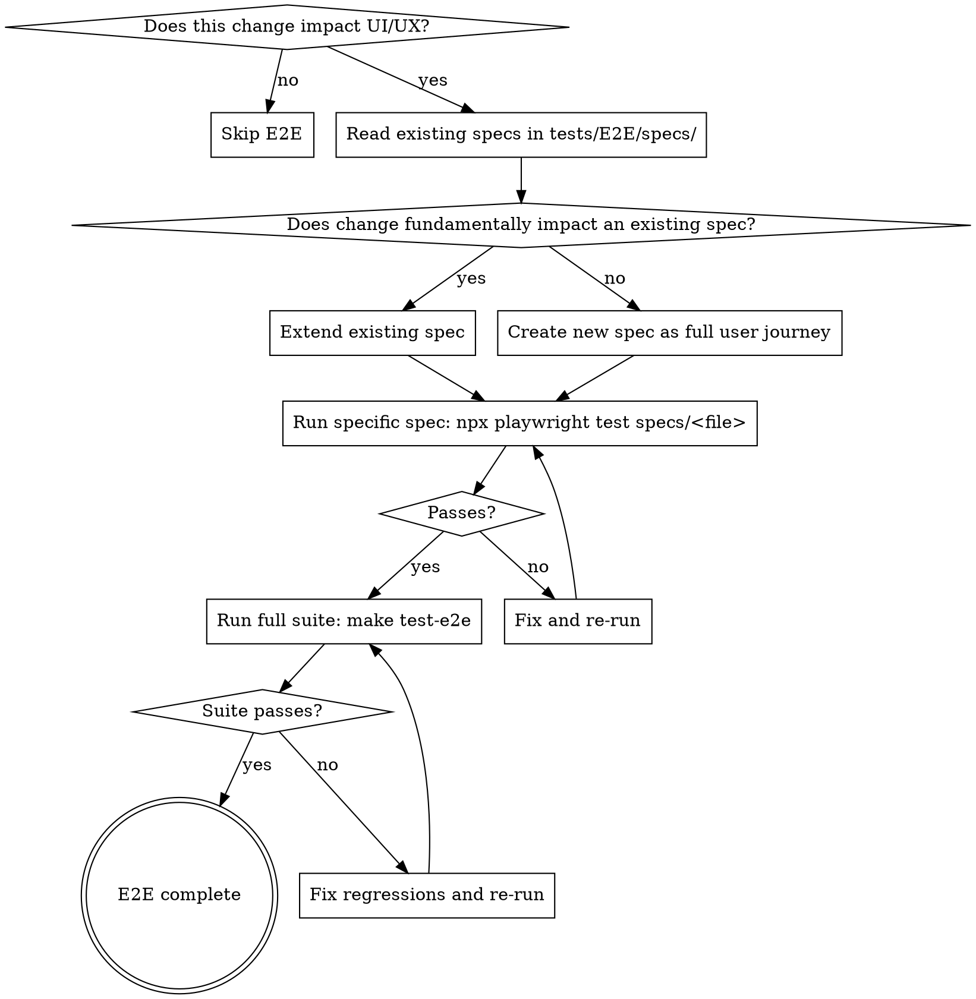

# E2E Test Discipline

## Overview

UI/UX-impacting changes require E2E coverage — no exceptions, no deferring. E2E specs must be **executed and passing** before work is complete. Writing a spec without running it is not completing the work.

**Violating the letter of these rules is violating the spirit of the rules.**

## Process Flow



## Rules

### 1. No Functional Tests Disguised as E2E

Each `test()` block must be a multi-step user journey. Use `test.step()` for individual operations within the journey. A spec with multiple `test()` blocks each testing one operation is a functional test suite — not an E2E spec.

### 2. E2E Specs Must Be Executed

`npm run test` and `make test` run Vitest/PHPUnit — they are **not** E2E verification. E2E requires:
1. `npx playwright test specs/<file>` (specific spec)
2. `make test-e2e` (full suite, after specific passes)

### 3. Check Existing Specs First

Before creating a new spec file, read all existing specs in `tests/E2E/specs/`. Extend an existing spec if the change fundamentally impacts that user journey. Create a new spec only when the change cannot be logically grouped into an existing journey.

Do NOT sidestep an existing spec just to avoid modifying it. Equally, do NOT force changes into a spec where they don't logically belong.

## Gotchas

- **Wait for grid loading**: Always `await` `getByTestId('grid-editor-loading')` to be hidden (15s timeout) before asserting grid content
- **Use `page.request`**: Not the standalone `request` fixture — shares browser cookies, avoids `strict_user_agent_check` session invalidation
- **DnD delays**: dnd-kit processes pointer events synchronously but React batches state. Include delays between drag steps (see `tests/E2E/helpers/drag.ts`)
- **Serial execution**: `workers: 1` — specs share database state. Always `resetFixtures` in `afterAll`
- **Fixture ordering**: YAML elements must be listed bottom-up (leaf → column → row → section → page) to prevent auto-scaffold duplicates
- **Locators**: Use `getByTestId` or `getByRole` — never CSS class selectors or DOM IDs

## Journey Pattern Quick Reference

```typescript
// WRONG — functional tests disguised as E2E
test('should duplicate row', async ({ page }) => { /* one assertion */ });
test('should show duplicated columns', async ({ page }) => { /* one assertion */ });
test('should persist after reload', async ({ page }) => { /* one assertion */ });

// CORRECT — user journey with debuggable steps
test('editor duplicates a row, verifies structure, and publishes', async ({ page }) => {
  await loadAndNavigate(page, 'fixture-name');

  await test.step('duplicate the first row in the section', async () => {
    // click duplicate, confirm dialog, assert row count
  });

  await test.step('verify duplicated row has same column structure', async () => {
    // assert column count and content matches
  });

  await test.step('reload and verify persistence', async () => {
    // page.reload(), wait for grid, assert structure
  });

  await test.step('publish and verify frontend', async () => {
    // publish action, navigate to frontend, assert rendered
  });
});
```

## Rationalization Table

| Excuse | Reality |
|--------|---------|
| "Unit and integration tests pass, so it's done" | Unit/integration tests don't prove the assembled UI works. E2E is required for UI-impacting changes. |
| "I'll fold it into a journey when the next opportunity arises" | That opportunity is now. You are implementing a UI change — write the E2E coverage now. |
| "A dedicated spec would be the one-operation-per-test anti-pattern" | The anti-pattern is many small `test()` blocks. A single journey spec covering the full user flow is correct. |
| "This is a small change, E2E is overkill" | Small UI changes break user flows. If it impacts UX, it needs E2E. |
| "I ran `npm run test` / `make test` and it passes" | Those run Vitest/PHPUnit. E2E requires `npx playwright test` then `make test-e2e`. Different tools, different coverage. |
| "The spec should pass based on the implementation" | You don't know until you run it. Run it. |
| "Creating a new spec keeps things isolated" | Check existing specs first. Extend if the change fundamentally impacts an existing journey. |

## Red Flags — STOP and Reassess

- More than 2 `test()` blocks in a single `describe` without `test.step()` inside them
- Running `npm run test` or `make test` and declaring E2E complete
- Creating a new spec file without having read existing specs first
- Saying "done" without a passing `make test-e2e` output
- Deferring E2E work to "the next natural opportunity"
- Using CSS class selectors or DOM IDs as locators

**All of these mean: Stop. Follow the process flow from the top.**
