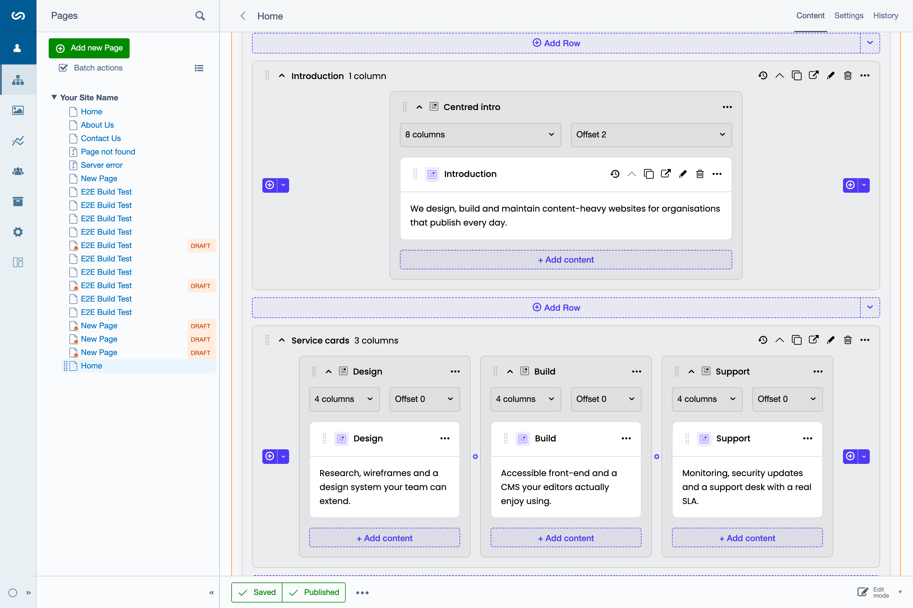

# SilverStripe Grid

A grid-based content block system for SilverStripe 6. Editors compose pages from **Section → Row → Column → content block** instead of one long HTML field, and the column widths they pick are emitted as your CSS framework's own classes — Bootstrap, Tailwind, Bulma, or an adapter you write yourself.



## Why

Elemental-style modules give editors a flat list of blocks and leave layout to the developer. Page builders give editors full layout control and leave the design system behind. This module sits between the two: the hierarchy is fixed and validated on the server, but within it editors control widths, offsets, and per-breakpoint visibility — and every choice resolves to classes your theme already ships.

- **A hierarchy that cannot be broken.** Sections hold rows, rows hold columns, columns hold content. Enforced at write time and at drop time, not just in the UI.
- **Framework-agnostic output.** One config-driven adapter turns a column of width 8 at the `md` breakpoint into `col-md-8` (Bootstrap), `md:col-span-8` (Tailwind), `is-8-md` (Bulma), or whatever your own framework spells it.
- **Responsive per column.** Each column has one default layout plus overrides for the breakpoints that differ — no override is stored when nothing changes.
- **Versioned like the rest of the CMS.** Draft/live, publish-with-the-page, per-element history, and a read-only grid in the history viewer.
- **Drag and drop across containers.** Move a block into another column, a column into another row, a row into another section — with optimistic updates and rollback on failure.
- **Multi-locale ready.** Optional [Fluent](docs/fluent.md) integration gives each locale its own isolated grid.

## The content model

```
Page
└── Section          zone-scoped band; the only thing allowed at page level
    └── Row          horizontal group
        └── Column   carries width / offset / visibility per viewport
            └── Content block   any ContentElement subclass
```

Writing a Section automatically creates the Row and Column beneath it, so a new section is usable immediately. Sections carry a **zone** (`main`, `sidebar`, …), which is how one page can host several independent grids.

## Requirements

- PHP ^8.3
- `silverstripe/framework` ^6.0, `silverstripe/cms` ^6.0, `silverstripe/admin` ^3.0, `silverstripe/versioned` ^3.0, `silverstripe/vendor-plugin` ^3.0
- `unclecheese/display-logic` ^4.0, `wedevelopnl/silverstripe-media-field` ^6.0.0-rc3
- Node >= 26 — only if you build the frontend bundle yourself; the package ships a compiled one

Optional:

- `silverstripe/reports` — adds the Grid Elements report to CMS Reports
- `tractorcow/silverstripe-fluent` — multi-locale support, one isolated grid per locale ([guide](docs/fluent.md))

> **Conflict:** this module conflicts with `dnadesign/silverstripe-elemental` and replaces its functionality. Coming from Elemental? See the [migration guide](docs/migration.md).

## Getting started

**1. Install.**

```bash
composer require wedevelopnl/silverstripe-grid
```

**2. Choose a CSS framework adapter.** `SS_GRID_ADAPTER` is required and has no default — an unset, empty, or invalid value throws when the container boots, which will also abort `dev/build`. Set it to a bundled preset (`bootstrap`, `tailwind`, or `bulma`, case-insensitive) or to the FQCN of your own adapter:

```dotenv
SS_GRID_ADAPTER="bootstrap"
```

**3. Enable the editor on your page types.**

```yaml
# app/_config/grid.yml
Page:
  extensions:
    Grid: WeDevelop\Grid\Extensions\GridPageExtension
```

**4. Render the grid in the page template.**

```silverstripe
<% loop $Sections %>$Me<% end_loop %>
```

**5. Build the database.**

```bash
vendor/bin/sake dev/build flush=1
```

That is a complete integration. Open a page in the CMS and the grid editor is on its Content tab.

From here, the two things most projects do next are [adding their own content blocks](docs/usage/custom-elements.md) and [overriding the module's templates in their theme](docs/usage/templates.md).

## Documentation

The full map, with a line on what each document covers, is in [`docs/`](docs/README.md).

**Start here**

- [The grid editor](docs/usage/grid-editor.md) — what the CMS editing experience looks like and what every control does

**Building with it**

- [Custom content elements](docs/usage/custom-elements.md) — subclass `ContentElement`, add CMS fields and templates
- [Template integration](docs/usage/templates.md) — the holder chain, zones, theme overrides, extension hooks
- [Internationalization](docs/usage/i18n.md) — translating strings, adding a locale, the PHP and JS collectors

**Integrating**

- [Migrating from Elemental / ElementalGrid](docs/migration.md) — the `BuildTask`-based upgrade from SilverStripe 5
- [Fluent (multi-locale)](docs/fluent.md) — setup, copy/clear behaviour, and the locale-aware migration task

**Architecture**

- [Backend architecture](docs/architecture/backend.md) — data model, API layer, services, validation
- [Grid Adapter System](docs/architecture/grid-adapter.md) — writing an adapter for another CSS framework
- [Drag and Drop](docs/architecture/drag-and-drop.md) — the frontend dnd-kit integration and backend reorder pipeline

**Contributing**

- [Contributing guide](CONTRIBUTING.md) — dev environment, tests, coverage, QA, and PR conventions
- [E2E fixture protocol](docs/testing/e2e-fixtures.md) — YAML schema, post-actions, dev fixture endpoint

## Changelog

See [CHANGELOG.md](CHANGELOG.md) for release history.

## License

BSD-3-Clause. See [LICENSE](LICENSE).

## Maintainers

[WeDevelop](https://www.wedevelop.nl/) — <development@wedevelop.nl>
