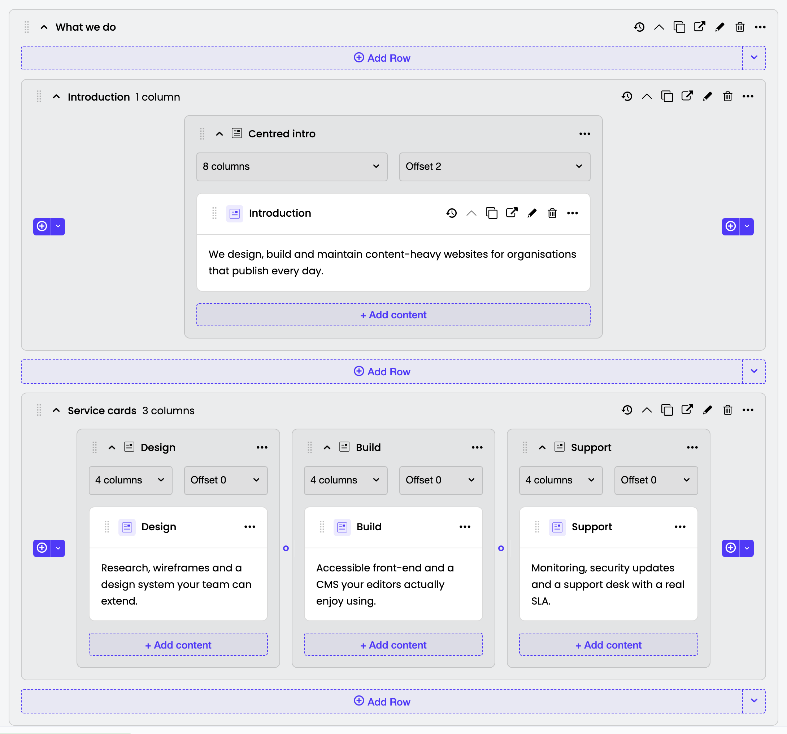
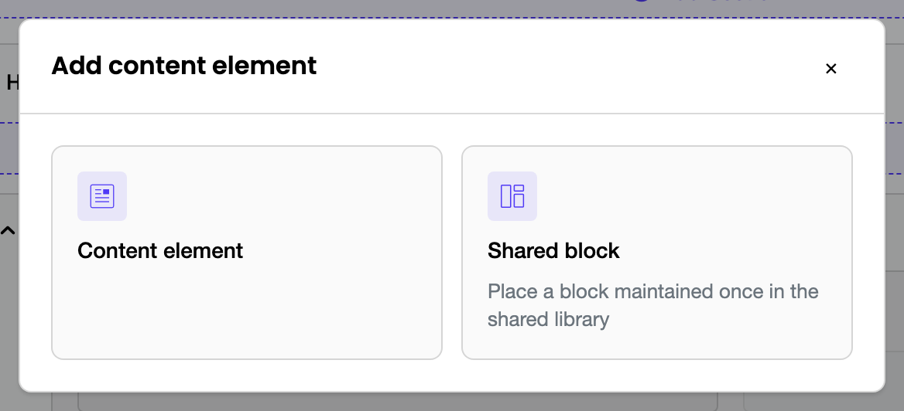
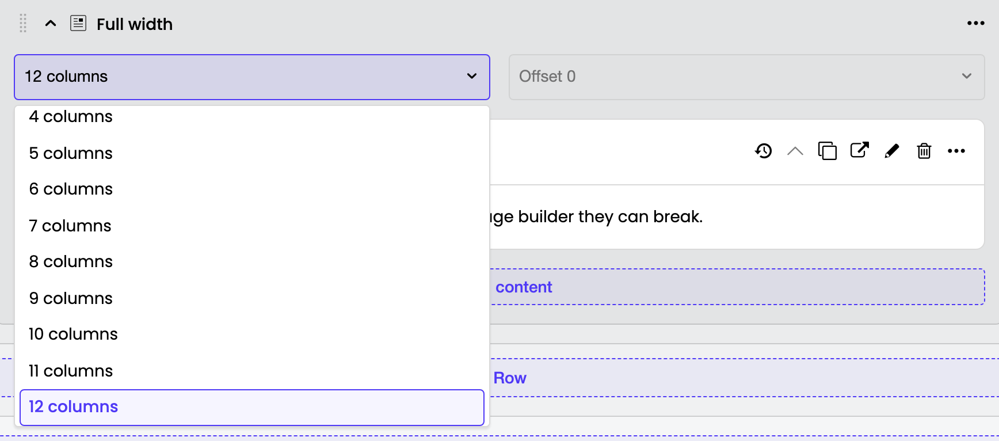
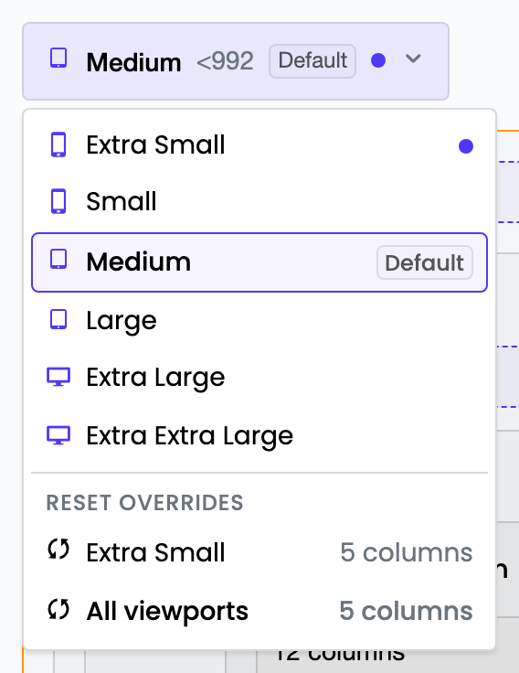
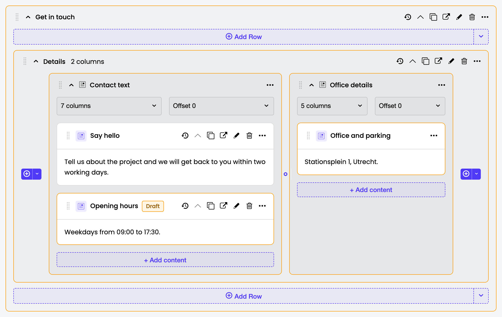
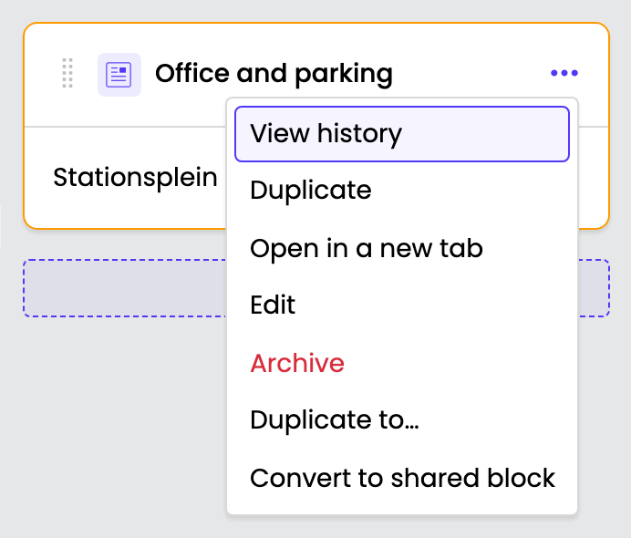

# The Grid Editor

A tour of what the module puts in front of a CMS user, and what each control does. Read this before the developer guides — the rest of the documentation assumes you know what a Section, Row and Column look like on screen.

Everything below was captured against the Bootstrap preset (a 12-column grid, viewports `xs`…`xxl`). Column counts and viewport names change with the [active adapter](../architecture/grid-adapter.md); nothing else does.

## Where the editor lives

The editor is a form field on the page's **Content** tab, below the standard page fields. It replaces the `Content` HTML editor rather than sitting next to it.

A page can carry more than one editor — one per [zone](templates.md#multi-zone-pages) — in which case each zone gets its own field with its own section list.

Projects can opt a page type into a **"Use grid on this page"** checkbox, letting editors choose the grid or the plain Content field per page. It is off by default, so the grid is simply always there unless your developers turned the toggle on — see [Per-page editor toggle](templates.md#per-page-editor-toggle).

## Anatomy

Reading the screenshot from the outside in:

| Region | What it is |
|--------|-----------|
| **Section** (`What we do`) | Top-level band on the page. Sections are the only thing that can sit at page level. |
| **Row** (`Introduction`, `Service cards`) | A horizontal group inside a section. The header shows the row title and its column count. |
| **Column** (`Centred intro`, `Design`, …) | A slot in the grid, with its own width and offset pickers. |
| **Content block** (the white cards) | The actual content. Each card shows its type icon, title, and a short text summary. |
| **`Add Section` / `Add Row`** | Insert a new child at that level. The caret at the button's right-hand end offers [placing a shared block](shared-blocks.md#placing-a-block) there instead. |
| **`+ Add content`** | Opens the type picker for a column's content. The picker's **Shared block** tile [places a shared block](shared-blocks.md#placing-a-block) instead of creating a new element; this button carries no caret. |
| **The `⊕` buttons flanking a row** | Insert a column before or after the ones already there — likewise with a caret for a shared column. |

The hierarchy is fixed and enforced on the server: **Section → Row → Column → content**. A section only ever holds rows, a row only ever holds columns, and a column holds any content block. You cannot nest a section inside a column.

Because the levels are fixed, creating a section also creates the row and column inside it, so a new section is immediately usable. The same happens one level down when you add a row.

## Structural changes save immediately

Every action in this guide — adding, moving, resizing, archiving, duplicating — is written to the database the moment you perform it, through the module's own API. They are **not** staged behind the CMS form's *Save* button.

The editor applies each change to the on-screen tree first and reconciles with the server afterwards. If the server rejects the change or the network fails, the tree snaps back to its previous state and an error appears. Nothing is left half-applied.

The *Save* button still governs the ordinary page fields (page name, URL segment, and each block's own fields when you open one for editing).

## Adding content

`+ Add content` inside a column opens the type picker:

Each tile is one `ContentElement` subclass, showing its `$singular_name`, icon, and description. The module ships a single generic block; projects add their own, and each new subclass appears here automatically with no registration step. See [Building a custom content element](custom-elements.md).

Picking a tile creates the block and drops it into the column. Open it with the pencil (**Edit**) action to fill in its fields.

## Column width and offset

Every column header carries two pickers — width and offset — that write straight to the column's grid settings.

- **Width** is how many grid columns the column spans, from 1 to the adapter's column count. The last entry in the list is **hidden**, which drops the column at the current viewport instead of giving it a width.
- **Offset** is how many empty grid columns to leave in front of it. The list stops where `width + offset` would overflow the row, so an invalid combination cannot be chosen. It is disabled on a full-width or hidden column, where an offset has nothing to do.

The `Offset 2` on the `Centred intro` column in the [anatomy screenshot](#anatomy) is how an 8-wide column ends up centred in a 12-column grid.

## Viewports

A column's width, offset, and visibility are stored as a **default** plus a set of **per-viewport overrides**. The default applies everywhere; an override applies only at its own viewport.

The control at the top of the editor picks which viewport you are editing:

- The list is the active adapter's viewports, largest breakpoint last.
- **Default** marks the viewport whose values are stored as the default rather than as an override — Bootstrap's `md` here.
- A **dot** next to a viewport means at least one column in this grid overrides it.
- **Reset overrides** clears overrides again: one entry per viewport that has any, plus **All viewports**. The number beside each entry is how many columns the reset would affect, and confirming it is a separate step.

Switch viewport, change a column's width, and you have created an override for that viewport only. Switch back and the default is untouched.

How a viewport *without* an override resolves is a project-level decision, not an editor one: the default strategy is **isolated** (it falls back to the default), and a project can switch `GridSettingsResolver` to **cascade** so overrides carry forward mobile-first. See [Grid Settings](../architecture/backend.md#grid-settings).

## Moving things

Each section, row, column, and content block has a drag handle (the dotted grip at the left of its header). Drop targets are constrained to the hierarchy, so a column can only land in a row and a block can only land in a column — including into a *different* row or column, on the same page.

Drops persist immediately, with the same optimistic-then-reconcile behaviour described above. Sort order is tracked per parent and, for sections, per zone: reordering one zone never renumbers another.

Dragging needs a pointer — mouse, trackpad or touch. It is the one part of the editor with no keyboard equivalent; see [Keyboard and screen readers](#keyboard-and-screen-readers).

The full mechanics are in [Drag and Drop](../architecture/drag-and-drop.md).

## Publishing state

Grid content is versioned and publishes with the page. Publishing the page publishes the whole tree beneath it in one action; there is no per-element publish button in the editor.

Two distinct signals:

- An **orange outline** means there is unpublished work *at or below* that element. It propagates up, so an outlined section may just be reporting a changed block three levels down.
- A **`Draft` or `Modified` pill** means the outlined element is itself the unpublished one. `Draft` is never published; `Modified` is published but changed since.

Outline with no pill therefore reads as "the change is somewhere below this". Screen readers get the same distinction announced as *"Contains unpublished changes"*, because the outline is a border colour and inaudible.

## Element actions

Every element exposes the same action set. On wide headers it renders as an icon row; on narrow ones — a card in a 4-column slot, or any column header — the whole set folds into the `⋯` menu:

| Action | Effect |
|--------|--------|
| **View history** | Opens the element's edit form on its History tab. |
| **Collapse** / **Expand** | Folds the element in the editor. A view preference, not content: it is remembered per grid area in your own browser and changes nothing on the element. |
| **Duplicate** | Copies the element, with its subtree, next to the original. |
| **Open in a new tab** | The element's edit form, in a new browser tab. |
| **Edit** | The element's edit form, in the current tab. |
| **Archive** | Removes the element. Asks for confirmation and names how many child elements go with it. |
| **Duplicate to…** | Copies the element to another page, choosing target page → zone → parent container. |
| **Convert to shared block** | Moves the element and its subtree into the shared block library, leaving a placement behind so this page keeps showing it. See [Shared blocks](shared-blocks.md). Not offered on a placement, on anything inside a block, or on content that already holds a placement — a block may not contain another one. |

Permissions are applied per action: **Archive** needs delete permission on the element, **Duplicate** and **Duplicate to…** need create permission, and **Convert to shared block** needs create permission on shared blocks (the library's own CMS section). An action the user cannot perform is dropped from the overflow menu entirely, and rendered greyed out in the icon row so the toolbar keeps a stable shape.

The header strip above the canvas also has a **collapse/expand all** button that folds every section at once.

> The strip's other three buttons — *Reset changes*, *Open page*, *Remove all sections* — are rendered disabled on purpose. They are placeholders for actions the design specifies but the editor does not implement yet.

## Keyboard and screen readers

Every control in this guide except the drag handles can be driven from the keyboard.

Grouped controls follow the W3C toolbar and listbox patterns: the **group** is a single tab stop and the arrow keys move inside it. That is what keeps a page of element cards to a few tab stops rather than a dozen per card.

| Control | Tab reaches | Arrow keys | Enter / Space | Escape |
|---------|-------------|-----------|---------------|--------|
| Element action row | the row, once | `←` `→` between actions, `Home` / `End` to either end | runs the action | — |
| `⋯` overflow menu | its trigger, the row's last stop | `↑` `↓` between items, `Home` / `End` | runs the item | closes it, focus returns to `⋯` |
| Width and offset pickers | the trigger | `↑` `↓` between values, `Home` / `End` | picks the value | closes it, focus returns to the trigger |
| **Duplicate to…** lists | each list, once | `↑` `↓` between options, `Home` / `End` | selects it and moves to the next step | closes the dialog |
| **Add content** tiles | each tile | — | adds the block | closes the dialog |

Navigation stops at the ends rather than wrapping. Entries you cannot use stay reachable so the list still reads completely — they simply refuse to activate, which is how a page with no grid zones behaves in **Duplicate to…**.

Two things are announced that the visual design conveys silently:

- **The dialogs are named by their own heading**, so *Add content element*, each **Duplicate to…** step, and the archive confirmation announce as a named dialog rather than an anonymous one. The confirmation reads its message — including the child count — along with the name.
- **Collapse toggles point at the region they fold**, so the expanded or collapsed state is announced against the element it belongs to instead of on its own.

`Add Section` and `Add Row` keep focus while the insert is in flight, and their label changes to *"Adding Section…"* and back. That swap *is* the progress announcement, which is why the button stays focused rather than going inert the way a disabled control would — and focus is still on it once the element lands, so you can add several without hunting for the button again. The `⊕` column buttons keep focus the same way, but being icon-only they announce nothing while the column is on its way. A second press mid-insert is ignored either way, so a slow response cannot produce two elements.

### Working without a pointer

Moving an existing element is the gap. **Duplicate to…** is the nearest substitute: it copies an element, with everything beneath it, into a container on another page, after which **Archive** removes the original. It offers no control over where in the target the copy lands, so it replaces a cross-container move, not a reorder within one.

Its page step lists up to 50 editable pages at a time, so on a large site the search box at the top of that step — a plain text field, reached with `Tab` — is how you find the target rather than the list itself.

The reasoning behind the gap, and what closing it would take, is in [Drag and Drop](../architecture/drag-and-drop.md#keyboard-support).

## Version history

Opening a page's **History** tab, or an element's **View history** action, renders the grid read-only at that version: same layout, no drag handles, no add buttons, no pickers. You can still switch viewport, so you can inspect how an old version was configured per breakpoint — the reset-overrides entries are absent, since there is nothing to write to.

## See also

- [Template integration](templates.md) — how what you build here renders on the front end
- [Building a custom content element](custom-elements.md) — adding your own block types to the picker
- [Grid Adapter System](../architecture/grid-adapter.md) — where the column count and viewport names come from
- [Drag and Drop](../architecture/drag-and-drop.md) — the reorder pipeline in detail
