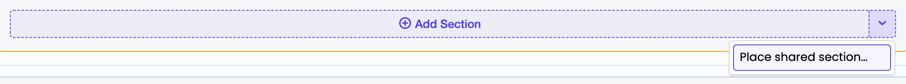

# Shared Blocks

A shared block is a piece of grid content that lives once in a central library and is *placed* on any number of pages. Editing it once updates every page that uses it.

Use one for content that must stay identical across pages — a call-to-action, a promotional banner, a contact strip. Use ordinary elements for anything a page should own outright.

## How it fits together

| Piece | What it is |
|---|---|
| **Shared block** | The library record. Holds exactly one subtree: a section, a row, a column, or a single content element, with everything beneath it. |
| **Placement** | The reference sitting in a page's grid. Holds no content of its own — only where it sits. Deleting one removes that placement, never the block. |

A block has its **own** draft/live lifecycle. Publishing a page never publishes the block behind it, and publishing the block updates every page at once. That separation is the whole point: it is also the part that most often surprises people, so the editor badges it (see [Publishing](#publishing)).

## Creating a block

Two routes, both ending in the same place.

**From existing page content** — open any element's actions menu and choose **Convert to shared block**. The subtree moves into the library and a placement takes its position. No content is copied, so element IDs and version history survive intact.

**From the library** — go to **Shared blocks** in the CMS menu and use the split **Add new shared section** button at the head of the toolbar. The block is created immediately and opens in its own editor, ready for content; there is no empty record to save first.

Its main half creates a **section-rooted** block, the common case. Its caret offers the other shapes, with the available content element types listed under **Shared content element**:

| Choose | You get | Placeable |
|---|---|---|
| *Add new shared section* | a section, scaffolded with a row and a column | at page root |
| *Add new shared row* | a row, scaffolded with a column | inside a section |
| *Add new shared column* | an empty column | inside a row |
| an element type by name | a single element of that type | inside a column |

Pick the shape by where the block needs to go — see [Placing a block](#placing-a-block). The choice is made once, at creation: a block's root cannot be swapped afterwards, though everything below it is freely editable. If you picked wrong, delete the block and add another.

New blocks are named *New shared block 1*, *2*, … Rename yours in the **Title** field — that name is what the placement chooser and the frame chip show.

The library listing has a **Type** column naming each block's root element — *Section*, *Row*, *Column*, or the content element's own type — so you can tell at a glance where a block can go. A block whose content has been removed reads *Empty* and cannot be placed anywhere.

> **After converting, publish the block.** Converting is a draft-stage operation, but it does have one live-visible effect — see [the conversion window](#the-conversion-window).

## Placing a block

Wherever you can add content you can also place a block:

- **Page root, inside a section, inside a row** — open the caret at the right-hand end of the
  *Add Section* / *Add Row* / *Add Column* button and choose **Place shared section / row /
  column**. Every insertion point offers it, so a block can land before the first child, in
  any gap, or at the end — no dragging afterwards.
- **Inside a column** — the **Shared block** tile in the content type picker.



Between columns the caret lives on the round gutter handle: hover it and the handle widens to
show the **+** and the caret side by side.

The chooser only lists blocks that fit where you are placing them. A block's *root type* decides this, mirroring the ordinary hierarchy:

| Placed at | Requires a block rooted at |
|---|---|
| Page root | a section |
| Inside a section | a row |
| Inside a row | a column |
| Inside a column | a content element |

So nothing the chooser offers can be rejected when you pick it.

## Editing a placed block

A placed block is **read-only on the page**. An inline edit inside a block would change every page that places it, and on a page that reach is easy to miss — so all editing happens in the library, where it is explicit. The frame makes the boundary visible: a chip naming the block and how many pages it reaches, plus a status marker when live has not caught up.

Inside the frame there is nothing to drag, add, remove or configure. The column size and offset selectors stay visible — they carry layout information — but are disabled.

The frame's own bar carries the only controls, next to its actions menu — and they act on the **block**, not on whichever element happens to root it:

| Control | Effect |
|---|---|
| **Open in a new tab** | Opens the block in the Shared blocks admin, in a new tab. |
| **Edit in the shared block library** | Goes to that same editor. |
| **Remove from this page** | Deletes the *placement*. The block, and every other page placing it, are untouched. |

Also deliberately not possible:

- **Dragging page content into the frame.** It would silently make that content shared. The editor refuses the drop, and so does the API.
- **Nesting** a block inside another block. This is what keeps cycles impossible.

To move a placement itself, use **Move up** / **Move down** in the frame's actions menu. Placements are not draggable in this version.

## Publishing

The frame's status marker reflects the block as a whole — the block record *and* every element in its subtree:

| Marker | Meaning |
|---|---|
| **Not published yet** | The block has never been published. It renders nothing on the live site. |
| **Unpublished changes** | The block or something in it has been edited since the last publish. Live still shows the previous version. |
| *(no marker)* | Draft and live are in sync. |

Publish with **Publish shared block** in the frame's actions menu, or from the library. The confirmation quotes how many pages it affects. Unpublishing removes the block from every live page at once.

Rolling a page back never touches the block; rolling the block back (its own history view) changes it everywhere.

### The conversion window

Converting re-parents the subtree from the page to the block, on the draft stage only — the live site is untouched at that moment and keeps rendering the old content.

The next time you publish the *page*, though, SilverStripe clears that subtree's live parent link, because as far as the page is concerned the content has left. From then until you publish the *block*, the live page renders nothing where the block sits.

This is why the editor badges a freshly converted block **Not published yet**. Publish it and live is whole again.

## Detaching

**Detach into this page** in the frame's actions menu replaces the placement with an independent deep copy owned by the page. The block and its other placements are untouched, and later edits to the block no longer reach this page. Use it when one page needs to diverge.

## Templates

A placement renders its block's root element directly, with no wrapper of its own — the markup is identical to the same subtree placed locally, so themes and grid adapters need no changes.

It does, however, need a template that knows to look for it:

```silverstripe
<% loop $GridZone('main') %>$Me<% end_loop %>
```

`$Sections` is a Section-only relation and **never** includes placements. It still works and is still supported, but a page rendered through it will silently omit any shared block. See [Template integration](templates.md#gridzone-vs-sections).

Failure modes render empty and log a warning rather than erroring: a block with nothing published yet, a block with no content in the current locale, or (defensively) a placement whose block is gone.

## Fluent (multi-locale)

Shared blocks follow the same model as the rest of the module — no second localisation strategy:

- The block **record** is a single cross-locale row. Its title is admin labelling.
- The block's **subtree** is locale-isolated. Locale X's version of a block is the content with that locale's ID hanging off it. Editing a block in one locale changes every page in that locale and no other.
- **Placements** are per-locale page content, and every locale's placement points at the same block.
- **Copying a page** to a locale copies its placements, not the block's subtree — the new locale points at the same block.
- **Copying a block** to a locale clones its subtree into that locale.
- A placement whose block has no content in the current locale renders empty.
- **Deleting a locale** removes that locale's block subtrees and that locale's placements. The block record itself survives.

See [Fluent support](../fluent.md) for installing and configuring Fluent.

## Deleting a block

**Delete block…** in the block's edit form retires it from the library. A block that is still placed is deletable — you are not asked to clear the pages first — but you must say what happens to the content on them:

| Choice | Effect |
|---|---|
| **Remove it from all N pages** | The placements go, and the content with them. |
| **Keep it on each page as its own copy** | Each page gets an independent copy of the block's current content. Nothing visibly changes; the copies are no longer linked, so editing one no longer updates the others. |

The confirmation quotes how many pages place the block and how many of those are published. Both choices reach live immediately, on every consuming page at once, without those pages being republished — the same reach as unpublishing the block.

The **Usage** tab of the block's edit form lists the consuming pages, and the **Shared blocks** report shows usage across the site.

Deleting the block is the *only* way to remove its content: the root element of a block carries no **Archive** and no **Duplicate**, because a block without a root renders nothing on every page that places it, and a block with two roots hides one of them. Everything below the root is freely archived and duplicated as usual.

Three things worth knowing:

- **The choice is not offered for an unplaced block** — there is nothing to decide, so the delete is one click.
- **A block with no content left cannot be kept.** "Keep it on each page as its own copy" needs something to copy; a block emptied outside the CMS — by a migration or a dev task — refuses that choice, and you have to remove the placements instead.
- **The copies are made from the block's draft content.** If the block had unpublished changes, unsharing publishes them onto the pages that were showing the older version. Publish the block first if that matters.

Deleting a *placement* is a different operation entirely: it removes that page's reference and leaves the block untouched. **Detach** goes one step further, replacing the placement with a local copy on that page alone.

## Reference

- Usage counts are **distinct pages**, not placements: a page using a block in two zones counts once, and under Fluent a page's per-locale placements count once.
- The model, the invariants that keep it tractable, and the publishing rules are described in [the backend architecture doc](../architecture/backend.md).
